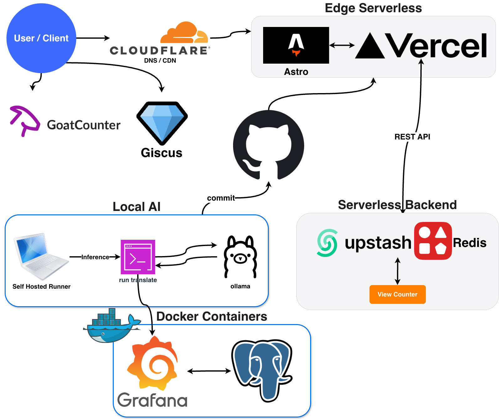

# hun-bot.dev
> **Zero-Cost, AI-Native Tech Blog** powered by **Local LLM Pipeline** 
> 
> Live Site: [https://hun-bot.dev](https://hun-bot.dev)

## Architecture & Workflow
**Hybrid Architecture**: Serverless Frontend (Vercel) + Local AI Backend (Mac M4 Pro).

## Key Engineering Highlights

| Component | Tech Stack | Description |
| :--- | :--- | :--- |
| **Orchestrator** | **Python 3.11** | Automated batch translation pipeline using `tqdm` & `psutil`. |
| **Inference** | **Ollama** | **Zero-Cost** local serving (En: `gemma2:9b` / Jp: `qwen2.5:7b`). |
| **Observability** | **Grafana + PG** | Real-time monitoring of **TPS (Tokens/sec)** & **GFLOPS**. |
| **Consistency** | **Regex/YAML** | Strict metadata parsing to prevent structure collapse. |